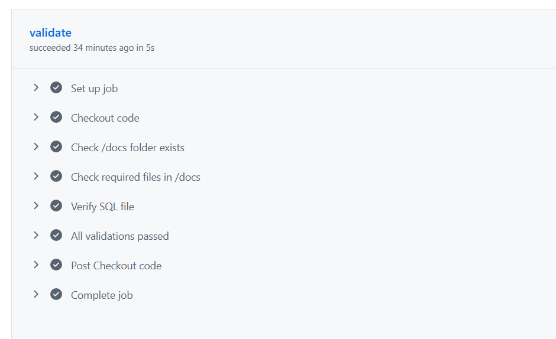

# 🏃 RaceDay

RaceDay is a full-stack web-based event management system designed for the South African road running, walking, and cycling community.

The system allows **Event Organisers** to create and manage events, categories, participant enrolments, and results. **Participants** can browse available events, enter events by selecting a category, view their enrolments, and track their personal performance history.

This project is an individual **Portfolio of Evidence (PoE)** developed progressively across three parts.

---

## 🔗 GitHub Repository

The complete project repository is available on GitHub:

**[RaceDay — Programming Part 1](https://github.com/Aphaphia/Programming-Part-1.git)**

---

## 👥 User Roles

### Organiser

Event Organisers can:

* Create events
* Edit event details
* Delete events
* Create and manage event categories
* View participant enrolments
* Capture participant results
* View results for events

### Participant

Participants can:

* Create an account
* Browse available events
* View event categories
* Enter an event by selecting a category
* View their own enrolments
* View and track their personal results

---

## 🛠️ Technology Stack

| Component            | Technology           |
| -------------------- | -------------------- |
| Backend              | ASP.NET Core Web API |
| Programming Language | C#                   |
| Database             | Microsoft SQL Server |
| Database Language    | T-SQL                |
| Frontend             | ASP.NET Core MVC     |
| Version Control      | Git & GitHub         |
| CI/CD                | GitHub Actions       |

---

## 📚 Project Structure

The RaceDay project is developed in three progressive parts:

### Part 1 — System Planning

Part 1 focuses on planning and designing the system before implementation.

It includes:

* Entity Relationship Diagram (ERD)
* REST API endpoint plan
* SQL Server database schema
* Seed data
* Initial project documentation

### Part 2 — REST API

Part 2 will implement the planned REST API using:

* ASP.NET Core Web API
* C#
* SQL Server
* RESTful endpoints

### Part 3 — MVC Frontend

Part 3 will implement the user-facing web application using:

* ASP.NET Core MVC
* Razor Views
* Controllers
* Models
* API integration

---

## 📁 Part 1 Documentation

All Part 1 planning documents are located in the `/docs` folder.

```text
docs/
├── raceday_erd.pdf
├── api_endpoint_plan.md
├── schema.sql
└── raceday-screenshot.png
```

### Section A — ERD

`raceday_erd.pdf`

The Entity Relationship Diagram defines the main entities, relationships, and structure of the RaceDay database.

### Section B — API Endpoint Plan

`api_endpoint_plan.md`

This document contains the planned REST API endpoints for the RaceDay system, including the operations required by Organisers and Participants.

### Section C — SQL Database Script

`schema.sql`

The SQL Server script contains the database schema and seed data required for the RaceDay application.

---

## 🖼️ Project Screenshot



---

## 🔄 CI/CD

GitHub Actions is used to automatically validate the project documentation whenever changes are pushed to the repository.

The workflow checks that the `/docs` folder exists and contains the required Part 1 planning files.

This provides an automated validation step and helps ensure that the required project documentation remains available in the repository.

---

## 🎥 Video Walkthrough

An unlisted YouTube walkthrough will be added here.

The walkthrough will demonstrate:

* Part 1 planning documents
* ERD design decisions
* API endpoint planning
* SQL database script
* Database creation and seed data running in SQL Server Management Studio (SSMS)

> **Video:** https://youtu.be/paFdpSpf5Ho?si=SaEHYHhTgYW2_tPV

---

## 🚀 Setup Instructions

### Part 1

Part 1 consists primarily of the system planning and database documentation.

The planning files can be found in:

```text
/docs
```

The SQL script can be opened and executed using **SQL Server Management Studio (SSMS)**.

### Part 2

Setup instructions for the ASP.NET Core Web API will be added when the API project is implemented.

### Part 3

Setup instructions for the ASP.NET Core MVC frontend will be added when the frontend project is implemented.

---

## 📌 Project Status

| Part   | Description                 | Status      |
| ------ | --------------------------- | ----------- |
| Part 1 | System Planning             | ✅ Completed |
| Part 2 | REST API Implementation     | ⏳ Upcoming  |
| Part 3 | MVC Frontend Implementation | ⏳ Upcoming  |

---

## 🎯 Project Objectives

The main objectives of RaceDay are to:

* Provide a central platform for managing road running, walking, and cycling events.
* Allow Organisers to efficiently manage events and categories.
* Allow Participants to enter events online.
* Maintain participant enrolment information.
* Record and manage participant results.
* Allow Participants to track their personal performance history.
* Provide a structured REST API for communication between the frontend and backend.
* Apply database design and software development principles throughout the project.

---

## 📖 Portfolio of Evidence

RaceDay is developed as an individual Portfolio of Evidence project, demonstrating the application of:

* Database design
* Entity Relationship Modelling
* SQL Server and T-SQL
* REST API design
* ASP.NET Core Web API development
* ASP.NET Core MVC development
* C# programming
* Git and GitHub
* CI/CD practices

---

## 👤 Author

**RaceDay — Individual Portfolio of Evidence Project**

Developed using **C#, ASP.NET Core, SQL Server, and ASP.NET Core MVC**.

_(To be completed in Part 2 once the API project is added.)_
